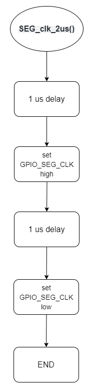
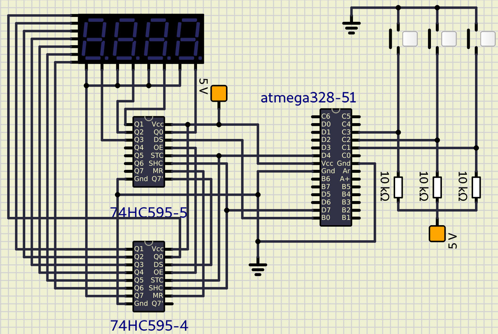

# Lab 5: Pavol Rohal

Link to your `Digital-electronics-2` GitHub repository:

   (https://github.com/221066/Digital-electronics-2)


### 7-segment library

1. In your words, describe the difference between Common Cathode and Common Anode 7-segment display.
   * CC SSD - Segments light up when the input is HIGH
   * CA SSD - Segments light up when the input is LOW

2. Code listing with syntax highlighting of two interrupt service routines (`TIMER1_OVF_vect`, `TIMER0_OVF_vect`) from counter application with at least two digits, ie. values from 00 to 59:

```c

uint8_t x = 0;
uint8_t a = 0;

ISR(TIMER1_OVF_vect)
{
	x++;
	if(x==10)
	{
		a++;
		x = 0;
		if (a==6)
		{
			a = 0;
			x = 0;
		}
	}

}
```

```c

ISR(TIMER0_OVF_vect)
{
	static uint8_t pos = 0;  // This line will only run the first time
	
	if(pos == 0)
	{
		SEG_update_shift_regs(x,pos);
		pos = 1;
	}
	else
	{
		SEG_update_shift_regs(a,pos);
		pos = 0;
	}
	
}
```

3. Flowchart figure for function `SEG_clk_2us()` which generates one clock period on `SEG_CLK` pin with a duration of 2&nbsp;us. The image can be drawn on a computer or by hand. Use clear descriptions of the individual steps of the algorithms.

   


### Kitchen alarm

Consider a kitchen alarm with a 7-segment display, one LED and three push buttons: start, +1 minute, -1 minute. Use the +1/-1 minute buttons to increment/decrement the timer value. After pressing the Start button, the countdown starts. The countdown value is shown on the display in the form of mm.ss (minutes.seconds). At the end of the countdown, the LED will start blinking.

1. Scheme of kitchen alarm; do not forget the supply voltage. The image can be drawn on a computer or by hand. Always name all components and their values.

   

